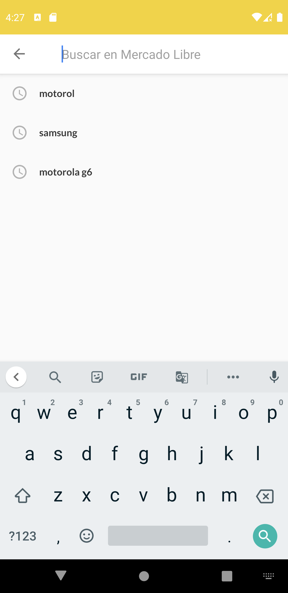

# MELI-Android

Es una app desarrollada en Kotlin aplicando Clean Architecure y haciendo uso de los recursos de la API púbilica de MercadoLibre. Además se guardan datos a nivel local utilizando Room.

## Screenshoots

  
  
  
  
  
  
  
  

## Detalles técnicos

Algunas de las librerías/conceptos/patrones utilizados son:

- Kotlin
  - Coroutines
  - Extension functions
  - Null-safety
  - Android extensions
  - Companion objects
  - Data classes
  - Sealed classes
- Clean Architecture
- MVVM
- SOLID
- Modularization
- Di con Koin
- Unit testing
- Repository pattern
- Singleton pattern
- Mappers
- Android architecture components
  - LiveData
  - ViewModel
- Navigation components
- Room
- Retrofit
- ConstraintLayout
- Glide
- Lottie
- GSON para serialization y deserialization de JSON
- Timber
- JUnit, Mockito
- Y mucho más ...

## Autor
Marcelo Cuevas
